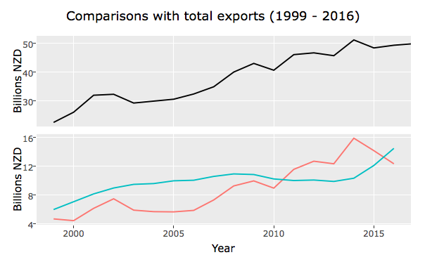
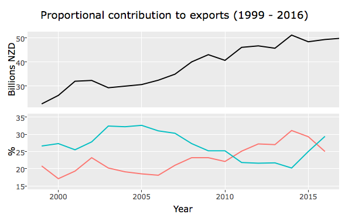
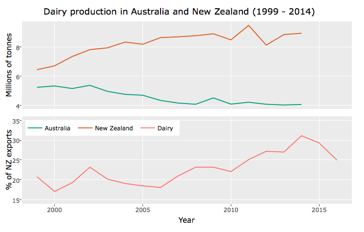

```{r setup, include=FALSE}
knitr::opts_chunk$set(echo = FALSE)
library(bookdown)
library(ggplot2)
library(tidyr)
library(plotly)
library(knitr)
library(shiny)
```

***
**Interactivity:** To access the interactive graphical features used in this report the `Rmarkdown` file for this document (`Assgn3.Rmd`) needs to be run in `RStudio`, with the working directory set as the source file (so that the `files` folder can be located). 

***

**Question One: New Zealand's main income earner**

To investigate this problem data on dairy exports (including casein) and international tourism expenditure in New Zealand, in New Zealand dollars (NZD), for 1999 to 2016 were obtained from Statistics New Zealand via Infoshare. International tourism expenditure is defined as spending by international travellers and international students staying in New Zealand for less than 12 months.  Alongside dairy exports, it contributes to New Zealand's revenue from exported goods and services. Data on the total annual value of exports (including re-exports), also in New Zealand dollars, were also obtained from the same source. 

We will compare the income generated from the dairy and tourism industries in dollars, as well as the proportional contribution of the sectors to the total export value. The latter will take into account the steady increase in annual export revenue since the mid 1970s, as illustrated in Figure \@ref(fig:exports). There also appears to be more volatility in the export market in the 21st century, compared to the past decades.

```{r exports, fig.cap="Trend in annual value of exports."}
# StatsNZ Infoshare comparison of tourism with dairy exports
NZcompare <- read.csv("files/TourismDairy.csv", skip=1, nrows=18)
colnames(NZcompare) <- c("Year", "Dairy", "Tourism")
# Change to billions of dollars (from millions)
NZcompare[2:3] <- NZcompare[2:3]/1000

# Data on total export value
NZexports <- read.csv("files/NZexports.csv", skip=1, nrows=66)
colnames(NZexports) <- c("Year", "Exports")
# Change to billions of dollars (rather than thousands)
NZexports$Exports <- NZexports$Exports/1000000

# Plot export trend
ggplot(NZexports) +
  geom_line(aes(x=Year, y=Exports)) +
  labs(title="New Zealand exports (1952 - 2017)", 
       y="Billions of dollars (NZD)")
```

From 1999 to 2010 international tourism expenditure exceeded the earnings from dairy exports. However growth in the tourism industry appeared to plateau towards the end of this period, while the value of dairy exports increased as it recovered from a few years of poor returns. Hence dairy exports exceeded international tourism expenditure for a few years, but the decreasing value of dairy exports and increasing international tourism expenditure of recent years suggest the tourism industry may retain it's dominance over the dairy sector in the export market.

The changes over the years also indicate more votality in the dairy sector than the tourism industry. Although both sectors show an overall positive trend, the value of dairy exports is more variable from year to year. 

```{r dollars, fig.cap="Dairy and tourism export earnings from 1999 to 2016."}
# Transform to a long df for plotting
NZcompare1 <- gather(NZcompare, Year)
colnames(NZcompare1) <- c("Year", "Sector", "Billions")

# Plot comparing earnings in dollars
compare_p <- ggplot(NZcompare1) +
  geom_line(aes(x=Year, y=Billions, group=Sector, col=Sector)) 
compare_p + 
  labs(title="Dairy exports and international tourism expenditure (1999 - 2016)",
       y="Billions of dollars (NZD)")
```

In Figure \@ref(fig:exports2000) changes in the value of dairy exports and international tourism expenditure are compared with the total value of exports for each year. We can see that New Zealand's export market is more sensitive to changes in the dairy sector rather than the tourism industry. The "ups-and-downs" in earnings from dairy exports are generally mirrored in the total value of exports for that year. However from 2015, the total export value appears to diverge from the continual decline in dairy export earnings. It is possible that the increased growth in the tourism industry has compensated for the losses in the dairy sector, but we would need to observe the pattern for more years to come, for confirmation.

***
**Interactivity:** We can use the interactive "Toggle Spike Lines", accessible from the hovering menu on the top right hand corner of Figure \ref{fig:exports2000}, to make the observations with ease. 

***

```{r exports2000, fig.cap="Trend in annual value of exports for 1999 to 2016.", fig.width=8}
export_p <- ggplot(NZexports[NZexports$Year>=1999, ]) +
  geom_line(aes(x=Year, y=Exports)) +
  labs(y="Billions NZD")

compare_p2 <- compare_p +
  labs(title="Comparisons with total exports (1999 - 2016)", 
       y="Billions NZD")

# Compare with total exports
compare_plotly <- ggplotly(compare_p2, tooltip=c("x", "y", "group")) %>% 
  layout(showlegend=FALSE)
subplot(export_p, compare_plotly, nrows=2, shareX=TRUE, titleY=TRUE)

# If not interactive (ie. for PDF output)
#
```

To further investigate if the surge in the tourism industry in recent years has helped to compensate for the lagging dairy industry, we will compare the proportional value added by each sector. As with previous monetary comparisons, Figure \@ref(fig:propn) shows international tourism expenditure contributed a greater proportion to New Zealand exports than the dairy sector from 1999 to 2010 and then dairy exports contributed a higher proportion for only a few years after that. It is interesting to note that although the monetary value of international tourism expenditure did not vary much between 2005 and 2014 (in Figure \@ref(fig:exports2000)), the proportional contribution of the tourism industry to the export economy was decreasing during this period. This highlights that the growth in the New Zealand export economy during this time was due to other sectors. On the other hand, the increasing proportional contribution of the tourism industry to the export economy since 2015 suggests that it may be a key player in buffering the effects of the declining contribution by the dairy sector.

Not surprisingly the patterns for the dairy sector shown in Figure \@ref(fig:exports2000) and Figure \@ref(fig:propn) are similar, since the performance of dairy exports and the overall export economy, are closely interlinked, as previously identified.

```{r propn, fig.cap="Proportion of exports from dairy and tourism sectors", fig.width=8}

# Merge datasets
NZcompare <- merge(NZcompare, NZexports, by="Year")
ExpPropn <- do.call(c, lapply(NZcompare[2:3], 
                              function(x){x/NZcompare$Exports*100}))

# Calculate proportions
NZcompare2 <- data.frame(Year = rep(NZcompare$Year, 2),
                         Percentage = round(ExpPropn, 1), 
                         Sector = c(rep(c("Dairy", "Tourism"), each=nrow(NZcompare))))

# Plot of proportions
propn_plot <- ggplot(NZcompare2) + 
  geom_line(aes(x=Year, y=Percentage, group=Sector, colour=Sector)) +
  ylim(15, 35) +
  labs(title="Proportional contribution to exports (1999 - 2016)", y="%")

# Compare with total exports
propn_plotly <- ggplotly(propn_plot, tooltip=c("x", "y", "group")) %>% 
  layout(showlegend=FALSE)
subplot(export_p, propn_plotly, nrows=2, shareX=TRUE, titleY=TRUE)

# If not interactive (ie. for PDF output)
#
```

For international comparisons, the World Bank provides data on the proportion of total exports attributed to international tourism receipts for countries around the world. We will focus on making comparsions with Australia, a larger economy but with similar geographic challenges as New Zealand in terms of attracting tourists and both countries are key producers for the international dairy market. Data from the Food and Agriculture Organization of the United Nations (FAOSTAT) will be used to compare changes in the volume of dairy exports from the two countries.

Figure \@ref(fig:tourism) compares the World Bank data on the tourism industry's contribution to the Australian export economy, with the Infoshare data for New Zealand, previously discussed. Tourism accounted for a higher proportion of total exports in New Zealand than Australia from 1999 t0 2015. Despite a difference of at least 10% between the two countries, there were similar patterns in changes over time. In particular, for both countries there was a downward trend in the contribution of the tourism industry to the export economy from 2005 until 2011. 

```{r tourism, fig.cap="Contribution of tourism industry to Australia and New Zealand's export markets"}
# World Bank data on % tourism contribution to exports
WBtourism <- read.csv("files/WBtourism.csv", skip=4)

# Subset data on Australia for 1999 onwards (avail to 2015)
AUStourism <- data.frame(1999:2015, 
                         t(WBtourism[WBtourism$Country.Name=="Australia", 44:60]))
colnames(AUStourism) <- c("Year", "Percentage")
rownames(AUStourism) <- NULL
AUStourism$Percentage <- round(AUStourism$Percentage, 1)
AUStourism$Country <- rep_len("Australia", nrow(AUStourism))

# NZ tourism % from previous data frame
NZtourism <- NZcompare2[NZcompare2$Sector=="Tourism", 1:2]
NZtourism$Country <- rep_len("New Zealand", nrow(NZtourism))

# Combine
INTtourism <- rbind.data.frame(AUStourism, NZtourism)

# Plot
ggplot(INTtourism) + 
  geom_line(aes(x=Year, y=Percentage, group=Country, colour=Country)) +
  labs(title="Tourism in Australia and New Zealand (1999 - 2016)", y="Percentage of total exports") +
  scale_color_brewer(type="qual", palette=2)
```

It is unclear whether the World Bank data included expenditure of international students living in countries for less than 12 months. This may contribute to the lower proportions shown for Australia. Unfortunately the World BanK data set did not include values for New Zealand, so it was not possible to verify this detail. However the magnitude of the differences observed in Figure \@ref(fig:tourism), suggest that the spending of short-term international students alone, would not account for the higher proportional contribution of New Zealand's tourism industry to its export economy. It is plausible that tourism is not as much of a key player in the Australian export economy since it has a more diverse range of export goods and services.

The FAOSTAT data on dairy production for 1999 to 2014 also show higher production levels for New Zealand than Australia. There gap has widened, with an overall positive trend in New Zealand's dairy production, while Australia gradually decreases its production. When comparing New Zealand's dairy production in volume with the proportional contribution of dairy exports to the total value of New Zealand exports, the changes do not neceassarily mirror each other. In particular, in 2011 New Zealand reached its highest dairy production volume for the period observed, but this did not necessarily translate into a higher proportion of export revenue being attributed to the dairy sector. This could be due to the increased production supplying the domestic rather than export market, and/or the price of dairy products on the export market was lower than previous years. The latter is likely since profitability of dairy exports is not only determined by volume, but also global dairy prices (see <http://www.stats.govt.nz/tools_and_services/newsletters/price-index-news/oct-13-dairy-exports.aspx>).

```{r dairy, fig.cap="Volume of annual dairy production in Australia and New Zealand.", fig.width=8}
# UN dairy production quantity
UNdairy <- read.csv("files/UNdairy.csv")
UNdairy <- UNdairy[c("Area", "Year", "Value")]

# Drop observations with NA's
UNdairy <- UNdairy[complete.cases(UNdairy), ]

# Find total value per year
INTdairy <- aggregate.data.frame(UNdairy$Value, by=list(UNdairy$Area, UNdairy$Year), FUN=sum)
colnames(INTdairy) <- c("Country", "Year", "Volume")
# Change to millions of tonnes units
INTdairy$Volume <- INTdairy$Volume/1000000

# Plot for tourism comparison
tourism_p <- ggplot(INTdairy) + 
  geom_line(aes(x=Year, y=Volume, group=Country, colour=Country)) +
  labs(title="Dairy production in Australia and New Zealand (1999 - 2014)", y="Millions of tonnes") +
  scale_color_brewer(type="qual", palette=2) +
  xlim(c(1999,2015))

tourism_ptly <- ggplotly(tourism_p, tooltip=c("x", "y", "group"))

dairyNZ_p <- ggplot(NZcompare2[NZcompare2$Sector=="Dairy", ]) + 
  geom_line(aes(x=Year, y=Percentage, colour=Sector)) +
  labs(y="% of NZ exports") +
  ylim(15, 35) 

subplot(tourism_ptly, dairyNZ_p, nrows=2, shareX=TRUE, titleY=TRUE) %>%
  layout(legend = list(orientation='h', x = 0.01, y = 0.46))

# If not interactive (ie. for PDF output)
#
```

The data obtained from Statistics New Zealand suggests the tourism industry had made greater financial contributions to the annual value of total exports, than the dairy sector, for most years in the last two decades. However the export economy remained more sensitive to changes in the dairy sector rather than the tourism industry. Furthermore, although the tourism industries in New Zealand and Australia reflected similar changes over the years observed, the trends for dairy production were gradually heading in different directions. 


**Question Two: Power and the non-central t-distribution** 

A simulation was created to explore the sample sizes required to achieve 80% power, under the given conditions. The simulation was used to cross-check the `TDist` functions in `R`, to gain a thorough understanding of the inputs and outputs of the functions. Power calculations were then made using these functions to make a recommendation on sample sizes to use. The findings from the simulation and calculations will be presented, followed by a comparison with the (usual) results from applying a normal approximation for power analysis.

***
**Interactivity:** The simulation shown in the `Shiny` app applies only 500 trials (rather than the default 1000), in order for the rendering of plots to keep up with the animation.

***

```{r}
# Function to generate and plot the t-distns for null and alt hypothesis
t_distns <- function(n, sd, sim=1000, show_power=T) {
  t_null <- replicate(sim, t.test(rnorm(n, 1, 1), rnorm(n, 1, 1), 
                                  alternative = "greater", var.equal = FALSE)$statistic)
  t_alt <- replicate(sim, t.test(rnorm(n, 1.5, sd), rnorm(n, 1, 1), 
                                 alternative = "greater", var.equal = FALSE)$statistic)
  
  # Given alpha=0.05
  t_cutoff <- quantile(t_null, 0.95)
  test_power <- sum(t_alt >= t_cutoff)/sim
  
  # Collect as data frame
  ts <- data.frame(t = c(t_null, t_alt), Hypothesis = rep(c("Null", "Alt"), each=sim))
  
  # Shading for power proportion
  alt_density <- data.frame(x = density(t_alt)$x, y = density(t_alt)$y)
  alt_shade <- alt_density[alt_density$x > t_cutoff, ]
  
  # Plot
  p <- ggplot(ts) + 
    geom_density(aes(x = t, group = Hypothesis, col = Hypothesis)) +
    geom_area(data=alt_shade, aes(x = x, y = y), fill = "red", alpha = 0.4) +
    theme_classic() +
    ggtitle("Simulated t-distributions under the null and alternative hypotheses")
  
  if (show_power) {
    p <- p + 
      annotate(geom="label", x=mean(t_alt), y=0.15, col="red",
             label=paste("Power\n", round(test_power*100, 1), "%", sep=""))
  }
  
  return(p)
}
```

The simulation allows the user to vary the sample size ($n$) and the standard deviation ($\sigma_T$) of the new insulin treatment (between 1.5 and 2 units). One-sided two-sample Welch t-tests, at the 5% significance level, are carried out on two sets of $n$ random numbers from the $N(1, 1^2)$ distribution. This generates the statistics required to simulate the t-distribution, given the null hypothesis is true. For the alternative hypothesis, that there is a difference of 0.5 units, $n$ random numbers from the $N(1, 1^2)$ and $N(1.5, \sigma_T^2)$ distributions are used instead. The smoothed density plots of the t-distributions for the null and alternative hypotheses are graphed together, with the resulting power percentage displayed.

```{r}
shinyApp(
  
  ui = fluidPage(
    sidebarLayout(
      sidebarPanel(
        sliderInput("sd_treat", label = "Standard deviation for Treatment group", 
                    min =  1.5, max = 2, step = 0.01, value = 1.5, width="600px", animate = T),
        sliderInput("sample_size", label = "Sample size", 
                    min =  50, max = 200, step = 1, value = 50, width = "600px", animate = T)),
    mainPanel(plotOutput("t_plot"))
    )),
  
  server = function(input, output) {
    output$t_plot <- renderPlot(t_distns(input$sample_size, input$sd_treat, 500))
  }

) 
```

Using the simulation we can confirm that given a fixed sample size, increasing the standard deviation for the HbA1c change in the new insulin treatment group, $\sigma_T$, will decrease the power. Although this is the general trend, it is interesting to note the amount of variation in the power values as $\sigma_T$ increases from 1.5 to 2. This negative relationship between $\sigma_T$ and the power of the test makes sense, since increased spread in the HbA1c change of the new insulin treatment group will make an effect more difficult to detect. 

On the other hand, we expect the power of the test to increase as the sample size increases, due to reductions in sample variation. Using the sliders to change the sample size when $\sigma_T=1.5$, suggests that 80% power is reached when $n\approx85$ and for $\sigma_T=2$ when $n\approx130$ (as shown in Figure \@ref(fig:sdLow) and Figure \@ref(fig:sdHigh), respectively). Again there is a surprising amount of variability in the simulated power values as the sample size increases, but the simulation gives us a "ball-park" idea of the range of possible sample sizes required to achieve 80% power, under the assumptions given in this problem.

```{r sdLow, fig.cap="Possible sample size for 80% power when $\\sigma_T$=1.5.", out.width="700px"}
include_graphics("files/sdLow.png", auto_pdf=F)
```

```{r sdHigh, fig.cap="Possible sample size for 80% power when $\\sigma_T$=2.", out.width="700px"}
include_graphics("files/sdHigh.png", auto_pdf=F)
```

The simulation was also useful for analysing the inputs and outputs of the `TDist` functions. In particular the non-centrality parameter, `ncp` argument. By comparing the density plots from the simulation with the theoretical density function `dt()`, we can confirm that the `ncp` argument is the hypothesized effect size standardised (i.e. 0.5 standardised with respect to the t-distribution of the null hypothesis). The non-centrality parameter shifts the t-distribution by `ncp` units from zero (the null hypothesis of no difference). Figure \@ref(fig:dt) compares the theoretical t-distributions (in black), with the results of a simulation of 1000 trials with $n=100$ and $\sigma_T=1.5$. 

```{r dt, fig.cap="Theoretical and simulated density plots.", fig.width=8}
# Example with 100 t-statistic values and sd=1.5 (for treatment group)
sample_n <- 100
sd_T <- 1.5
var_x <- 1 + sd_T^2 
ncp <- 0.5/sqrt(var_x/sample_n)

# Simulated t-distributions
simulated <- t_distns(sample_n, sd_T, show_power=F)

# Theoretical t-distributions using dt() function
theory <- simulated$data
theory$t_dt <- ifelse(theory$Hypothesis=="Null", 
                      dt(theory$t, df=sample_n-1), # Default ncp is centralised
                      dt(theory$t, df=sample_n-1, ncp=ncp))
# Theoretical test cutoff
t_alpha <- qt(0.95, df=sample_n-1)

# Plot
simulated +
  geom_line(data=theory, aes(x=t, y=t_dt, group=Hypothesis)) +
  geom_vline(xintercept=c(t_alpha, ncp), col=c("blue", "red"), lty=2) +
  annotate("text", x=ncp+1.5, y=max(theory$t_dt)+0.02, label=paste("ncp", round(ncp, 1), sep="="), col="red") +
  annotate("text", x=t_alpha-2, y=max(theory$t_dt)+0.02, label=paste("t(0.95)", round(t_alpha, 1), sep="="), col="blue")
```

The distribution of t-statistic values for when the alternative hypothesis is true, can be approximated by the non-central t-distribution with parameters $df=n-1$ and $ncp=\frac{0.5}{\sqrt{\frac{\sigma^2}{n}}}=$ `r round(ncp, 1)`. Meanwhile the distribution simulated under the null hypothesis being true, follows the default central t-distribution, as expected. The theoretical $t_{0.95, df=n-1}$ value, shown in red, closely approximates the boundary where 5% of the simulated tests, assuming the null hypothesis, would be rejected.

#### Power calculations for sample sizes using t-distributions

Figure \ref{fig:theory} illustrates the relationship between the test statistic cut-off for a one-sided test at $\alpha$%  significance level and the non-centrality parameter for the alternative hypothesis' t-distribution. 

Let $X_C$ and $X_T$ represent the response measures for the control group and the treatment group, respectively. Then the relationship shown in Figure \@ref(fig:theory), in terms of the central t-distribution, can be expressed as:

$$
t_{1-\alpha}=ncp+t_{\beta}\\
\text{where }\beta=1-power \quad
\text{and}\quad ncp=\frac{E(\bar{X_T}-\bar{X_C})}{\sqrt{\frac{Var(\bar{X_T}-\bar{X_C})}{n}}}
$$

```{r theory, fig.cap="Graphical representation of theory behind power calculations."}
ggplot(data=theory) +
  geom_line(aes(x=t, y=t_dt, group=Hypothesis, col=Hypothesis)) +
  geom_vline(xintercept=c(t_alpha, ncp), col=c("blue", "red"), lty=2) +
  annotate("label", x=ncp, y=max(theory$t_dt)+0.02, label="ncp", col="red") +
  annotate("label", x=t_alpha, y=max(theory$t_dt)+0.02, label="t[1-alpha]", parse=TRUE, col="blue") +
  labs(x="t", y="density", title="Theoretical t-distributions") +
  theme_classic()
```

For the diabetes treatment problem the response measure is the decrease in HbA1c levels and the control group receives the standard insulin, while the treatment group receives the new insulin. We want to find the minimum values for $n$, required to achieve 80% power when using a one-sided test at a 5% significance level. Hence $1-\alpha=0.95$ and $\beta=1-0.8=0.2$.
We are also given $X_C \sim N(1, 1^2)$, $\sigma_T \in [1.5, 2]$ and $E[\bar{X_T}-\bar{X_C}] \ge 0.5$. Hence:

$$
\begin{aligned}
Var(\bar{X_T}-\bar{X_C})&=1+\sigma_T^2\\
ncp&=\frac{0.5}{\sqrt{\frac{1+\sigma_T^2}{n}}}\\
t_{1-\alpha}&=\frac{0.5}{\sqrt{\frac{1+\sigma_T^2}{n}}}+t_{\beta}\\
\frac{t_{1-\alpha}-t_{\beta}}{0.5}&=\frac{1}{\sqrt{\frac{1+\sigma_T^2}{n}}}\\
\left(\frac{0.5}{t_{1-\alpha}-t_{\beta}}\right)^2&=\frac{1+\sigma_T^2}{n}\\
\left(\frac{t_{1-\alpha}-t_{\beta}}{0.5}\right)^2&=\frac{n}{1+\sigma_T^2}\\
\therefore n&=\left(\frac{t_{1-\alpha}-t_{\beta}}{0.5}\right)^2\times(1+\sigma_T^2)
\end{aligned}
$$
As observed from the simulation, we expect the minimum required sample size to increase as the variability in the measures increase. The linear equation for $n$ in terms of $\sigma_T^2$, shown above, confirms this relationship (the t-statistic values are constants).

A function was written to find the required sample size, using the t-distribution, given the standard deviation of the treatment group. The Satterthwaite's approximation for the degrees of freedom was used for the t-distribution. The range of sample sizes found using this function will be compared with results from the `power.t.test()` function in `R` and the standard normal approximation approach.

```{r, echo=TRUE}
# Function to calculate required sample size, n, using t-distribution
power_n <- function(sd, n=NULL, tdist=TRUE) {
  if(tdist) {
    # Satterthwaite's estimate for df
    df_est <- (1/n+sd^2/n)^2/(1/(n^2*(n-1))+sd^4/(n^2*(n-1)))
  }
  a <- ifelse(tdist, qt(0.95, df=df_est), qnorm(0.95))
  b <- ifelse(tdist, qt(0.2, df=df_est), qnorm(0.2))
  n <- ((a-b)/0.5)^2*(1+sd^2)
  return(ceiling(n))
}

# Min n when sd=1.5
# Using n=85 as a conservative estimate based on simulation observations
tmin_n <- power_n(1.5, n=85)
# Max n when sd=2
# Using n=130 as a conservative estimate based on simulation observations
tmax_n <- power_n(2, n=130)

# Min and max n from normal approximation 
zmin_n <- power_n(1.5, tdist=FALSE)
zmax_n <- power_n(2, tdist=FALSE)
```

The power calculations using the t-distribution recommended sample sizes between `r tmin_n` and `r tmax_n`, for each treatment group, depending on the variability of measures for the treatment group. Based on the simulation, this seems to be a sensible range for the minimum required sample sizes for $\sigma_T \in [1.5, 2]$. Normal approximations for sample sizes generated similar results, [`r zmin_n`, `r zmax_n`]. There was not a big difference between the estimates obtained from the two approaches, because the degrees of freedom used were large enough for the t-distribution to be relatively symmetrical, rather than skewed. Furthermore the alternative distributions observed in the simulation appeared approximately normal.

## References

#### Question 1

Food and Agriculture Organization of the United Nations. (2017). FAOSTAT Lifestock Processed. Retrieved from <http://www.fao.org/faostat/en/#data/QP>

Statistics New Zealand. (2017). Retrieved from <http://www.stats.govt.nz/infoshare/>

The World Bank. (2017). International tourism, receipts (% of total exports). Retrieved from <https://data.worldbank.org/indicator/ST.INT.RCPT.XP.ZS>

#### Question 2
Teixeira, A., Rosa, Á., & Calapez, T. (2009). Statistical power analysis with microsoft excel: normal tests for one or two means as a prelude to using non-central distributions to calculate power. Journal of Statistics Education, 17(1), n1. 

Wikipedia. (2016). Welch–Satterthwaite equation. Retrieved from <https://en.wikipedia.org/wiki/Welch%27s_t-test>
